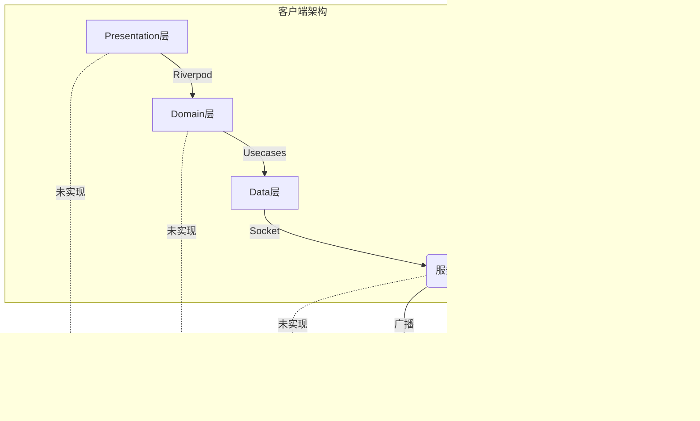
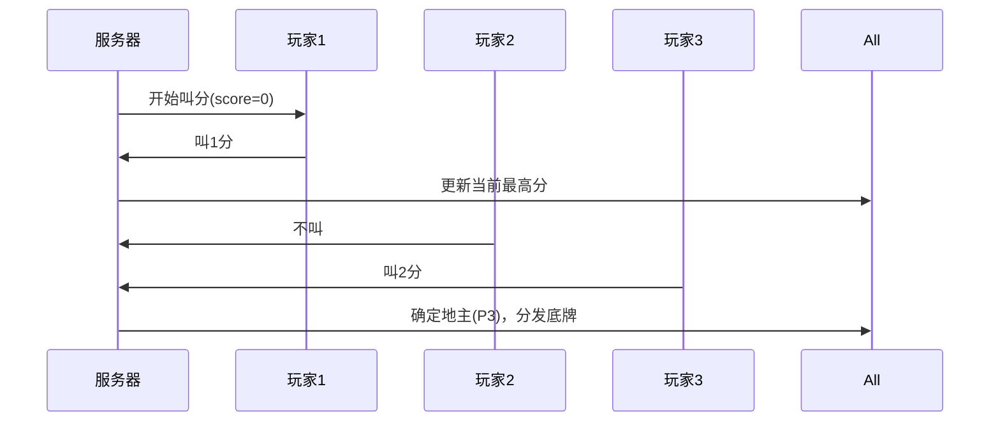

# Landlords
flutter写的斗地主

架构

```mermaid
graph TD
    A[客户端] -->|Socket.io| B(服务器)
    B -->|广播| C[玩家1]
    B -->|广播| D[玩家2]
    B -->|广播| E[玩家3]
    
    subgraph 客户端架构
        F[Presentation层] -->|Riverpod| G[Domain层]
        G -->|Usecases| H[Data层]
        H -->|Socket| B
    end
    
    subgraph 待完善点
        B -.->|未实现| I[牌型验证]
        G -.->|未实现| J[叫地主逻辑]
        F -.->|未实现| K[记牌器UI]
    end
```

时序图

```mermaid
sequenceDiagram
    participant S as 服务器
    participant P1 as 玩家1
    participant P2 as 玩家2
    participant P3 as 玩家3
    
    S->>P1: 开始叫分(score=0)
    P1->>S: 叫1分
    S->>All: 更新当前最高分
    P2->>S: 不叫
    P3->>S: 叫2分
    S->>All: 确定地主(P3)，分发底牌
```